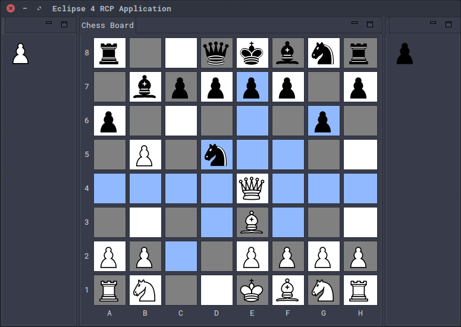

## alpha-beta-chess
A chess game built with Eclipse RCP.

### Development Walkthrough
Check out [this YouTube playlist](https://www.youtube.com/playlist?list=PL36SguL4LIwmhgHkziX-2C91SOTQl1rEL) to see how this app has been built step by step.

### Controls
 * Double-click on a piece you control. This highlights the squares that the piece is allowed to move.
 * Left-click one of the highlighted squares to move the selected piece. Now it's the AI's turn.
 * Wait until the AI makes a move for a few seconds.

### AI Player
 * Makes its moves according to the alpha-beta pruning algorithm reinforced with iterative deepening.
 * Has a fixed amount of time to make a move each turn. 
 * Starts with a search depth of 5. Constantly increments the depth and restarts the search as long as there is time remaining.
 * Remembers the best move it found on the previous search. If time runs out during the current search, makes that move immediately.
